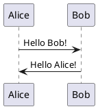
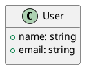

# Quick Start Guide

Get started with CLM in 5 minutes! This guide will walk you through creating and building your first course.

## Prerequisites

- CLM installed (see [Installation Guide](installation.md))
- Basic familiarity with command line
- A text editor

## Step 1: Create Course Directory

Create a directory for your course:

```bash
mkdir my-first-course
cd my-first-course
```

## Step 2: Create Course Configuration

Create a file named `course.xml`:

```xml
<?xml version="1.0" encoding="UTF-8"?>
<course>
    <name>
        <de>Mein erster Kurs</de>
        <en>My First Course</en>
    </name>
    <prog-lang>python</prog-lang>
    <description>
        <de>Beschreibung</de>
        <en>A first course</en>
    </description>
    <certificate>
        <de>Zertifikat</de>
        <en>Certificate</en>
    </certificate>
    <sections>
        <section>
            <name>
                <de>Abschnitt 1</de>
                <en>Section 1</en>
            </name>
            <topics>
                <topic>topic_001</topic>
            </topics>
        </section>
    </sections>
</course>
```

**What this means**:
- `<name>`: Bilingual course title (German and English)
- `<prog-lang>`: Default programming language for notebooks
- `<sections>`: Course structure with topics

## Step 3: Create Course Content

Create a simple directory structure:

```bash
mkdir -p section_001
```

Create a Python file `section_001/topic_001.py`:

```python
# %% [markdown]
"""
# Welcome to My First Course

This is a simple Python notebook.
"""

# %% [markdown]
"""
## Basic Python
"""

# %%
# Simple calculation
x = 42
y = 10
result = x + y
print(f"The answer is: {result}")

# %%
# List comprehension
numbers = [1, 2, 3, 4, 5]
squared = [n**2 for n in numbers]
print(f"Squared numbers: {squared}")
```

**Format Explanation**:
- `# %% [markdown]` - Markdown cell marker
- `"""..."""` - Markdown content
- `# %%` - Code cell marker
- Regular Python code follows

## Step 4: Build Your Course

Run CLM to process your course:

```bash
clm build course.xml
```

You should see output like:

```
Processing course: My First Course
Processing section: section_001
Processing topic: topic_001
  ✓ topic_001.py → topic_001.ipynb
  ✓ topic_001.py → topic_001.html
Course built successfully!
```

## Step 5: View the Results

Check the output directory:

```bash
tree output/
```

You'll see:

```
output/
├── speaker/
│   └── section_001/
│       ├── topic_001.ipynb
│       └── topic_001.html
└── participant/
    └── section_001/
        ├── topic_001.ipynb
        └── topic_001.html
```

**Open in browser**:
```bash
# Linux
xdg-open output/speaker/section_001/topic_001.html

# macOS
open output/speaker/section_001/topic_001.html

# Windows
start output/speaker/section_001/topic_001.html
```

## Step 6: Add a Diagram (Optional)

Create a PlantUML diagram `section_001/sequence.puml`:



Rebuild the course:

```bash
clm build course.xml
```

The diagram will be converted to `sequence.png` in the output directory.

## Step 7: Use Watch Mode

For iterative development, use watch mode:

```bash
clm build course.xml --watch
```

Now CLM will automatically rebuild whenever you save changes to your files!

**Try it**:
1. Edit `topic_001.py`
2. Save the file
3. CLM automatically rebuilds
4. Refresh your browser to see changes

Press `Ctrl+C` to stop watch mode.

## What's Next?

### Learn More About Course Structure

- [Configuration Guide](configuration.md) - Detailed course.xml options
- Add more sections and topics
- Use different output formats (HTML, notebook, code)
- Support multiple languages

### Add More Content Types

**PlantUML Diagrams**:


**Draw.io Diagrams**:
- Create diagrams with Draw.io desktop app
- Save as `.drawio` files
- CLM converts them to images

### Try Different Languages

**C++ Notebook** (`topic_cpp.cpp`):
```cpp
// %% [markdown]
"""
# C++ Example
"""

// %%
#include <iostream>
#include <vector>

int main() {
    std::vector<int> numbers = {1, 2, 3, 4, 5};
    for (int n : numbers) {
        std::cout << n * n << " ";
    }
    return 0;
}
```

Update `course.xml`:
```yaml
prog_lang: cpp
```

### Advanced Features

- **Templates**: Customize output appearance
- **Multiple Languages**: Generate English and German versions
- **Custom Output Formats**: Configure specific notebook conversions
- **Caching**: CLM automatically skips unchanged files

## Common Tasks

### Rebuild Everything (Clear Cache)

```bash
# Remove cache database
rm clm_cache.db clm_jobs.db

# Rebuild
clm build course.xml
```

### Change Output Directory

Use the `--output-dir` CLI flag:
```bash
clm build course.xml --output-dir ./dist
```

### Generate Only Speaker Version

Use output targets in `course.xml`:
```xml
<output-targets>
    <output-target name="speaker">
        <path>./output/speaker</path>
        <kinds><kind>speaker</kind></kinds>
    </output-target>
</output-targets>
```

## Troubleshooting

### Nothing Happens When I Build

**Check**:
- Is `course.xml` in the current directory?
- Do you have any `.py` files in section directories?
- Run with `--log-level DEBUG` for more info:
  ```bash
  clm build course.xml --log-level DEBUG
  ```

### Notebook Execution Fails

**Check**:
- Is Python installed?
- For other languages (C++, C#, etc.), are the kernels installed?
- Check error messages in CLM output

### Diagrams Not Converting

**PlantUML**:
- Is Java installed? (`java -version`)
- Is `PLANTUML_JAR` environment variable set?

**Draw.io**:
- Is Draw.io installed?
- Is `DRAWIO_EXECUTABLE` set?
- On Linux servers, is Xvfb running?

See [Troubleshooting Guide](troubleshooting.md) for more help.

## Examples

Want to see more examples? Check out:

- CLM repository `examples/` directory (if available)
- Test fixtures in `tests/fixtures/`
- Real course examples (links in README)

## Getting Help

- **Documentation**: [User Guide](README.md)
- **Issues**: https://github.com/hoelzl/clm/issues
- **Repository**: https://github.com/hoelzl/clm/

---

**Congratulations!** You've built your first course with CLM! 🎉
